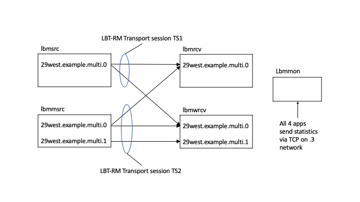

# mon_demo
A set of Ultra Messaging configuration files and a test script
to demonstrate setting up UM automatic monitoring.

# Table of contents

<sup>(table of contents from https://luciopaiva.com/markdown-toc/)</sup>

## COPYRIGHT AND LICENSE

All of the documentation and software included in this and any
other Informatica Ultra Messaging GitHub repository
Copyright (C) Informatica. All rights reserved.

Permission is granted to licensees to use
or alter this software for any purpose, including commercial applications,
according to the terms laid out in the Software License Agreement.

This source code example is provided by Informatica for educational
and evaluation purposes only.

THE SOFTWARE IS PROVIDED "AS IS" AND INFORMATICA DISCLAIMS ALL WARRANTIES
EXPRESS OR IMPLIED, INCLUDING WITHOUT LIMITATION, ANY IMPLIED WARRANTIES OF
NON-INFRINGEMENT, MERCHANTABILITY OR FITNESS FOR A PARTICULAR
PURPOSE.  INFORMATICA DOES NOT WARRANT THAT USE OF THE SOFTWARE WILL BE
UNINTERRUPTED OR ERROR-FREE.  INFORMATICA SHALL NOT, UNDER ANY CIRCUMSTANCES,
BE LIABLE TO LICENSEE FOR LOST PROFITS, CONSEQUENTIAL, INCIDENTAL, SPECIAL OR
INDIRECT DAMAGES ARISING OUT OF OR RELATED TO THIS AGREEMENT OR THE
TRANSACTIONS CONTEMPLATED HEREUNDER, EVEN IF INFORMATICA HAS BEEN APPRISED OF
THE LIKELIHOOD OF SUCH DAMAGES.

## REPOSITORY

See https://github.com/UltraMessaging/mon_demo for code and documentation.

## INTRODUCTION

Informatica recommends that Ultra Messaging users enable the
automatic monitoring feature in their UM-based applications and most
UM daemons (Store, DRO, etc.).

This repository has a script and configuration files to demonstrate
UM's automatic monitoring capability.

### Impact of Monitoring on Latency

Starting in [UM version 6.10](https://ultramessaging.github.io/currdoc/doc/ChangeLog/html1/index.html#streamingenhancementsfor6_10), 
properly-configured automatic monitoring does not significantly affect
the latency or throughput for application messages.
(Before UM 6.10, there was a contention point that caused the occasional
latency outlier. This was fixed in 6.10.)

### Configuration Goals

* Put monitoring data on a separate Topic Resolution Domain (TRD) from
production data.
* For the monitoring TRD, use unicast UDP with the "lbmrd" for topic resolution.
* For the monitoring data, use the TCP protocol.
* Route monitoring packets to a different network interface than
the production data.
For example, use the administrative network.
This eliminates contention for network resources.
Note that multicast is not used for monitoring.
* Disable the monitoring context's MIM and request ports.
This minimizes the use of host resources.

The "demo.cfg" configuration file is for production data.

The "mon.cfg" configuration file is for monitoring data.

The publisher and subscriber applications used in this demo are:
* [lbmsrc](https://ultramessaging.github.io/currdoc/doc/example/index.html#examplelbmsrc_c) -
Publish to one topic: "29west.example.multi.0".
* [lbmmsrc](https://ultramessaging.github.io/currdoc/doc/example/index.html#examplelbmmsrc_c) -
Publish to two topics: "29west.example.multi.0" and "29west.example.multi.1".
* [lbmrcv](https://ultramessaging.github.io/currdoc/doc/example/index.html#examplelbmrcv_c) -
Subscribe to one topic: "29west.example.multi.0".
* [lbmwrcv](https://ultramessaging.github.io/currdoc/doc/example/index.html#examplelbmwrcv_c) -
Subscribe to two topics: "29west.example.multi.0" and "29west.example.multi.1"
(uses a wildcard pattern).

Also used are:
* [lbmrd](https://ultramessaging.github.io/currdoc/doc/Design/manpagesforlbmrd.html) -
Unicast topic resolution daemon for the monitoring data TRD.
* [lbmmon](https://ultramessaging.github.io/currdoc/doc/example/index.html#examplelbmmon_c) -
Capture monitoring records and write them to a file.

## Run the demo

First, edit the files "demo.cfg" and "mon.cfg" and make appropriate changes
for your network and environment. 

The "tst.sh" shell script runs a set of applications and the
"lbmmon" program to collect the statistics.
It takes about one minute and ten seconds to run.

See the file "lbmmon.log" for the output of my example run of the
script.
Note that the "MCS" process has advantages over the "lbmmon" program,
but for demonstration purposes, "lbmmon" is easier to set up.

The "tst.sh" script intentionally introduces a small amount of loss
on one of the subscriber applications.
This is to demonstrate the presence of loss/NAK-related statistics.

## Interpreting the Data

Here's an illustration of the test:


The TS1 transport session is published by the "lbmsrc" app and
in this run has the source string:
````
LBTRM:10.29.4.101:12090:3000f59f:239.101.3.10:14400
````

The TS2 transport session is published by the "lbmmsrc" app and
in this run has the source string:
````
LBTRM:10.29.4.101:12091:3e76123d:239.101.3.10:14400
````
Note that lbmmsrc publishes two topics but only has one transport session.
This is because both topics are mapped to the same transport session
using the following configuration from "demo.cfg":
````
source transport_lbtrm_multicast_address 239.101.3.10
````

The file "lbmmon.log" contains the output of the "lbmmon" program for a
a sample run of the "tst.sh" script.
It contains statistics records from each of the apps.

### Monitoring Records

This test run writes three kinds of monitoring records to "lbmmon.log":
* Source Statistics (written by the apps "lbmsrc" and "lbmmsrc")
* Receiver Statistics (written by the apps "lbmrcv" and "lbmwrcv")
* Context Statistics (written by all of the apps)

### lbmsrc

The "[lbmsrc](https://ultramessaging.github.io/currdoc/doc/example/index.html#examplelbmsrc_c)"
app publishes to one topic.
Its statistics consist of one context record and one source record
per monitoring interval.

#### Source Statistics

Here is the final source record from "lbmsrc":
````
Source statistics received from lbmsrc at 10.29.3.101, process ID=6423, object ID=2125090, context instance=046d9ff4251cbe42, domain ID=0, sent Wed May 11 14:16:07 2022
Source: LBTRM:10.29.4.101:12090:3000f59f:239.101.3.10:14400
Transport: LBT-RM
    LBT-RM datagrams sent                                 : 50000
    LBT-RM datagram bytes sent                            : 2850000
    LBT-RM datagrams in transmission window               : 50000
    LBT-RM datagram bytes in transmission window          : 2850000
    LBT-RM NAK packets received                           : 432
    LBT-RM NAKs received                                  : 495
    LBT-RM NAKs ignored                                   : 0
    LBT-RM NAKs shed                                      : 0
    LBT-RM NAKs ignored (retransmit delay)                : 0
    LBT-RM retransmission datagrams sent                  : 495
    LBT-RM datagrams queued by rate control               : 0
    LBT-RM retransmission datagrams queued by rate control: 0
    LBT-RM retransmission datagram bytes sent             : 28215
````

See [lbm_src_transport_stats_lbtrm_t_stct Struct Reference](https://ultramessaging.github.io/currdoc/doc/API/structlbm__src__transport__stats__lbtrm__t__stct.html)
for information about all of the fields.

***Notable source statistics:***

* ***LBT-RM datagrams sent: 50000*** - This is how many messages "lbmsrc" was
directed to send.
As this is the last record, it is not particularly interesting.
However, if we look at two consecutive source records from about 30 seconds
prior, we see values 21121 and 25245, for a difference of 4124.
The records are from 5 seconds apart, giving about 824 messages per
second.
This corresponds approximately with the "lbmsrc" invocation, which specifies a
sleep time of 1 ms between sends.
In a real-world scenario,
statistics would probably not be reported every 5 seconds.
It would be a longer period measured in minutes, or even tens of minutes.
Getting a 10-minute average rate does not provide insight into the burstiness
of the data.

* ***LBT-RM NAKs received: 495*** - The app "lbmrcv" was invoked
with an artificial loss rate of 1%, which is randomized.
495 is approximately equal to 1% of 50,000.
Note that "NAKs received" is a more useful metric than "NAK packets received".

* ***LBT-RM retransmission datagrams sent: 495*** - In this simple example,
every NAK received generated a retransmission.
In a network with multiple receivers experiencing loss, it is not
unusual for some NAKs to be rejected and not generate retransmission.
The "ignored", "shed", and "ignored (retransmit delay)" counters
are reasons for rejecting retransmissions.

#### Context Statistics

Here is the final context record from "lbmsrc":
````
Context statistics received from lbmsrc at 10.29.3.101, process ID=6423, object ID=2125090, context instance=046d9ff4251cbe42, domain ID=0, sent Wed May 11 14:16:07 2022
    Topic resolution datagrams sent                    : 165
    Topic resolution datagram bytes sent               : 23595
    Topic resolution datagrams received                : 477
    Topic resolution datagram bytes received           : 63086
    Topic resolution datagrams dropped (version)       : 0
    Topic resolution datagrams dropped (type)          : 0
    Topic resolution datagrams dropped (malformed)     : 0
    Topic resolution send failures                     : 0
    Topics in source topic map                         : 1
    Topics in receiver topic map                       : 2
    Unresolved topics in receiver topic map            : 0
    Unknown LBT-RM datagrams received                  : 0
    Unknown LBT-RU datagrams received                  : 0
    Number of times message send blocked               : 0
    Number of times message send returned EWOULDBLOCK  : 0
    Number of times response send blocked              : 0
    Number of times response send returned EWOULDBLOCK : 0
    Number of duplicate UIM messages dropped           : 0
    Number of UIM messages received without stream info: 0
    Number of data message fragments lost              : 0
    Number of data message fragments unrecoverably lost: 0
    Receiver callbacks min service time (microseconds) : 18446744073709551615
    Receiver callbacks max service time (microseconds) : 0
    Receiver callbacks mean service time (microseconds): 0
````

See [lbm_context_stats_t_stct Struct Reference](https://ultramessaging.github.io/currdoc/doc/API/structlbm__context__stats__t__stct.html)
for information about all of the fields.

***Notable context statistics:***

* ***Topic resolution datagrams received: 477*** - With UDP-based
topic resolution (as is being used in this demo),
this gives the overall load of topic resolution traffic.
Each context receives ALL of the TR datagrams in the TRD.
The prior context record from "lbmsrc" had a timestamp of 14:16:02
and the TR datagrams received count was 446.
So over a 5 second period, 11 TR datagrams were sent,
for an overall rate of about 2 per second.

* ***Topics in source topic map: 1*** - The "lbmsrc" app publishes a
single source.
You can see how many sources (topics) are published in each app.

* ***Topics in receiver topic map: 2*** - With UDP-based topic
resolution (as is being used in this demo),
this gives you an idea of the total number of topics in the TRD.
But several conditions cause this number to be inaccurate,
either an overcount or an undercount.
With UDP-based topic resolution, this should only be used to give a
general idea.
(With TCP-based TR, only topics subscribed to will be counted here.)

* ***Unresolved topics in receiver topic map: 0*** - this would be non-zero
if the application has subscribed to topics for which there are no publishers.

* ***Receiver callbacks min service time (microseconds): 18446744073709551615*** -
The "lbmsrc" app does not have any receivers,
so the counter is at its initial value.
It is set to the maximum possible 64-bit unsigned value (0xffffffffffffffff).

* ***Number of times message send blocked: 0*** -
With blocking sends (the default), this counts the number of times that
the sender attempted to exceed the maximum configured output rate.
For streaming, this indicates exceeding the
[LBT-RM rate limiter](https://ultramessaging.github.io/currdoc/doc/Config/html1/index.html#transportlbtrmdataratelimitcontext).
For persistence, it could also mean exceeding the configured
[flight size](https://ultramessaging.github.io/currdoc/doc/Config/html1/index.html#umeflightsizesource).

* ***Number of times message send returned EWOULDBLOCK: 0*** -
Same as "blocked" above, but with
[non-blocking sends](https://ultramessaging.github.io/currdoc/doc/API/lbm_8h.html#ab8a470f02029480f179cc4872b7fa713).

### lbmmsrc

The "[lbmmsrc](https://ultramessaging.github.io/currdoc/doc/example/index.html#examplelbmmsrc_c)"
app publishes to two topics.
But both topics are mapped to the same transport session.
Therefore, there is one context record and only one source record
per monitoring interval.

#### Source Statistics

Here is the final source record from "lbmmsrc":
````
Source statistics received from lbmmsrc at 10.29.3.101, process ID=6424, object ID=171f090, context instance=fb96c92f7aa0fba5, domain ID=0, sent Wed May 11 14:16:02 2022
Source: LBTRM:10.29.4.101:12091:3e76123d:239.101.3.10:14400
Transport: LBT-RM
    LBT-RM datagrams sent                                 : 47377
    LBT-RM datagram bytes sent                            : 2700489
    LBT-RM datagrams in transmission window               : 47377
    LBT-RM datagram bytes in transmission window          : 2700489
    LBT-RM NAK packets received                           : 456
    LBT-RM NAKs received                                  : 500
    LBT-RM NAKs ignored                                   : 0
    LBT-RM NAKs shed                                      : 0
    LBT-RM NAKs ignored (retransmit delay)                : 0
    LBT-RM retransmission datagrams sent                  : 500
    LBT-RM datagrams queued by rate control               : 0
    LBT-RM retransmission datagrams queued by rate control: 0
    LBT-RM retransmission datagram bytes sent             : 28500
````

See [lbm_src_transport_stats_lbtrm_t_stct Struct Reference](https://ultramessaging.github.io/currdoc/doc/API/structlbm__src__transport__stats__lbtrm__t__stct.html)
for information about all of the fields.

***Notable source statistics:***

* ***LBT-RM datagrams sent: 47377*** - The "lbmmsrc" app was directed to
send 50,000 messages.
Why does the final source record only show 47,377?
The "lbmmsrc" app sends it messages, sleeps for 1 second, and then exits.
The last monitoring record was taken about 2.6 seconds before the last message
was sent.
The next monitoring record was scheduled to be sent 5 seconds after that.
But the "lbmmsrc" app exited before that next monitoring interval expired.
In contrast, the "lbmsrc" app (above) sleeps 5 seconds after it sends
its final message,
allowing enough time for one more monitoring interval after the last send.

The discussion of the other stats is similar to the "lbmsrc" stats.

#### Context Statistics

Here is the final context record from "lbmmsrc":
````
Context statistics received from lbmmsrc at 10.29.3.101, process ID=6424, object ID=171f090, context instance=fb96c92f7aa0fba5, domain ID=0, sent Wed May 11 14:16:02 2022
    Topic resolution datagrams sent                    : 156
    Topic resolution datagram bytes sent               : 29827
    Topic resolution datagrams received                : 449
    Topic resolution datagram bytes received           : 59565
    Topic resolution datagrams dropped (version)       : 0
    Topic resolution datagrams dropped (type)          : 0
    Topic resolution datagrams dropped (malformed)     : 0
    Topic resolution send failures                     : 0
    Topics in source topic map                         : 2
    Topics in receiver topic map                       : 2
    Unresolved topics in receiver topic map            : 0
    Unknown LBT-RM datagrams received                  : 0
    Unknown LBT-RU datagrams received                  : 0
    Number of times message send blocked               : 0
    Number of times message send returned EWOULDBLOCK  : 0
    Number of times response send blocked              : 0
    Number of times response send returned EWOULDBLOCK : 0
    Number of duplicate UIM messages dropped           : 0
    Number of UIM messages received without stream info: 0
    Number of data message fragments lost              : 0
    Number of data message fragments unrecoverably lost: 0
    Receiver callbacks min service time (microseconds) : 18446744073709551615
    Receiver callbacks max service time (microseconds) : 0
    Receiver callbacks mean service time (microseconds): 0
````

See [lbm_context_stats_t_stct Struct Reference](https://ultramessaging.github.io/currdoc/doc/API/structlbm__context__stats__t__stct.html)
for information about all of the fields.

***Notable context statistics:***

* ***Topics in source topic map: 2*** - The "lbmmsrc" app publishes
two sources.

The discussion of the other stats is similar to the "lbmsrc" stats.

### lbmrcv

The "[lbmrcv](https://ultramessaging.github.io/currdoc/doc/example/index.html#examplelbmrcv_c)"
app subscribes to one topic.
That topic is published by both the "lbmsrc" and "lbmmsrc" apps,
so "lbmrcv" will join both transport sessions.
Its statistics consist of one context record and two receiver records
(one for each joined transport session).

#### Receiver Statistics 1

Here is the final receiver record from "lbmrcv" for transport session TS1
"LBTRM:10.29.4.101:12090:3000f59f:239.101.3.10:14400":
````
Receiver statistics received from lbmrcv at 10.29.3.101, process ID=6421, object ID=2261270, context instance=21fea6bff8aaa771, domain ID=0, sent Wed May 11 14:16:12 2022
Source: LBTRM:10.29.4.101:12090:3000f59f:239.101.3.10:14400
Transport: LBT-RM
    LBT-RM datagrams received                                 : 50000
    LBT-RM datagram bytes received                            : 2850000
    LBT-RM NAK packets sent                                   : 432
    LBT-RM NAKs sent                                          : 495
    Lost LBT-RM datagrams detected                            : 489
    NCFs received (ignored)                                   : 0
    NCFs received (shed)                                      : 0
    NCFs received (retransmit delay)                          : 0
    NCFs received (unknown)                                   : 0
    Loss recovery minimum time                                : 23ms
    Loss recovery mean time                                   : 49ms
    Loss recovery maximum time                                : 965ms
    Minimum transmissions per individual NAK                  : 1
    Mean transmissions per individual NAK                     : 1
    Maximum transmissions per individual NAK                  : 3
    Duplicate LBT-RM datagrams received                       : 0
    LBT-RM datagrams unrecoverable (window advance)           : 0
    LBT-RM datagrams unrecoverable (NAK generation expiration): 0
    LBT-RM LBM messages received                              : 50000
    LBT-RM LBM messages received with uninteresting topic     : 0
    LBT-RM LBM requests received                              : 0
    LBT-RM datagrams dropped (size)                           : 0
    LBT-RM datagrams dropped (type)                           : 0
    LBT-RM datagrams dropped (version)                        : 0
    LBT-RM datagrams dropped (hdr)                            : 0
    LBT-RM datagrams dropped (other)                          : 0
    LBT-RM datagrams received out of order                    : 0
````

See [lbm_rcv_transport_stats_lbtrm_t_stct Struct Reference](https://ultramessaging.github.io/currdoc/doc/API/structlbm__rcv__transport__stats__lbtrm__t__stct.html)
for information about all of the fields.

***Notable receiver statistics:***

* ***LBT-RM datagrams received: 50000*** - number of messages received
from that source on this transport session.
As before, earlier records can be compared to get average rates.

* ***LBT-RM NAKs sent: 495*** - this matches the number of NAKs
received by the source,
because this is the only application that is experiencing datagram loss.

* ***Lost LBT-RM datagrams detected: 489*** - number of datagrams that were
not received when they should have been.
Note that this number is 6 smaller than the number of NAKs sent.
This is because of the artificial loss introduced in the "lbmrcv" program.
The 1% loss applies to retransmissions as well as original transmissions.
There were 489 original NAKs, and about 1% of the retransmissions were lost,
requiring a second NAK.
So the six extra NAKs represent the 1% loss of the retransmissions.

* ***Loss recovery mean time: 49ms*** - most of the lost datagram were
retransmitted immediately upon reception of their initial NAKs.
The initial NAK backoff time defaults to 50 ms.
This backoff is randomized between 25 and 75 ms,
but should average to about 50.

* ***Loss recovery maximum time: 965*** - Six of the lost datagrams
required a second try to recover. The backoff interval is configured to 400,
but that value is randomized between 200 and 600.
The fact that the statistic is 965 suggests that for one of the
datagrams, three tries were required.
Given the randomization of the backoff intervals,
three tries could take as little as 25+200+200=425 ms,
and as much as 75+600+600=1275 ms.
The number 965 is comfortably within that range.

* ***Maximum transmissions per individual NAK: 3*** - this confirms the
suspicion raised regarding the loss recovery maximum time.

#### Receiver Statistics 2

Here is the final receiver record from "lbmrcv" for transport session TS2
"LBTRM:10.29.4.101:12091:3e76123d:239.101.3.10:14400":
````
Receiver statistics received from lbmrcv at 10.29.3.101, process ID=6421, object ID=2261270, context instance=21fea6bff8aaa771, domain ID=0, sent Wed May 11 14:16:07 2022
Source: LBTRM:10.29.4.101:12091:3e76123d:239.101.3.10:14400
Transport: LBT-RM
    LBT-RM datagrams received                                 : 50000
    LBT-RM datagram bytes received                            : 2850000
    LBT-RM NAK packets sent                                   : 482
    LBT-RM NAKs sent                                          : 529
    Lost LBT-RM datagrams detected                            : 524
    NCFs received (ignored)                                   : 0
    NCFs received (shed)                                      : 0
    NCFs received (retransmit delay)                          : 0
    NCFs received (unknown)                                   : 0
    Loss recovery minimum time                                : 23ms
    Loss recovery mean time                                   : 41ms
    Loss recovery maximum time                                : 495ms
    Minimum transmissions per individual NAK                  : 1
    Mean transmissions per individual NAK                     : 1
    Maximum transmissions per individual NAK                  : 2
    Duplicate LBT-RM datagrams received                       : 0
    LBT-RM datagrams unrecoverable (window advance)           : 0
    LBT-RM datagrams unrecoverable (NAK generation expiration): 0
    LBT-RM LBM messages received                              : 50000
    LBT-RM LBM messages received with uninteresting topic     : 25000
    LBT-RM LBM requests received                              : 0
    LBT-RM datagrams dropped (size)                           : 0
    LBT-RM datagrams dropped (type)                           : 0
    LBT-RM datagrams dropped (version)                        : 0
    LBT-RM datagrams dropped (hdr)                            : 0
    LBT-RM datagrams dropped (other)                          : 0
    LBT-RM datagrams received out of order                    : 0
````

See [lbm_rcv_transport_stats_lbtrm_t_stct Struct Reference](https://ultramessaging.github.io/currdoc/doc/API/structlbm__rcv__transport__stats__lbtrm__t__stct.html)
for information about all of the fields.

***Notable receiver statistics:***

* ***Loss recovery maximum time: 495*** - Using the "lbmrcv" analysis above,
this suggests that the maximum number of tries to recover is only 2.

* ***Maximum transmissions per individual NAK: 2*** - Confirmed.

* ***LBT-RM LBM messages received with uninteresting topic: 25000*** -
This is a ***VERY*** important statistic.
This indicates that the transport session is carrying topics that
the "lbmrcv" is not interested in (isn't subscribed to).
In this case, fully half of the messages received on this transport session
are being discarded.
This is a significant amount of wasted effort to receive, parse, and discard
the uninteresting messages.
It suggests that the publisher should be reconfigured, probably mapping the
topics to two different transport sessions.

#### Context Statistics

Here is the final context record from "lbmrcv":
````
Context statistics received from lbmrcv at 10.29.3.101, process ID=6421, object ID=2261270, context instance=21fea6bff8aaa771, domain ID=0, sent Wed May 11 14:16:12 2022
    Topic resolution datagrams sent                    : 89
    Topic resolution datagram bytes sent               : 5607
    Topic resolution datagrams received                : 487
    Topic resolution datagram bytes received           : 64059
    Topic resolution datagrams dropped (version)       : 0
    Topic resolution datagrams dropped (type)          : 0
    Topic resolution datagrams dropped (malformed)     : 0
    Topic resolution send failures                     : 0
    Topics in source topic map                         : 0
    Topics in receiver topic map                       : 2
    Unresolved topics in receiver topic map            : 0
    Unknown LBT-RM datagrams received                  : 0
    Unknown LBT-RU datagrams received                  : 0
    Number of times message send blocked               : 0
    Number of times message send returned EWOULDBLOCK  : 0
    Number of times response send blocked              : 0
    Number of times response send returned EWOULDBLOCK : 0
    Number of duplicate UIM messages dropped           : 0
    Number of UIM messages received without stream info: 0
    Number of data message fragments lost              : 260
    Number of data message fragments unrecoverably lost: 0
    Receiver callbacks min service time (microseconds) : 18446744073709551615
    Receiver callbacks max service time (microseconds) : 0
    Receiver callbacks mean service time (microseconds): 0
````

See [lbm_context_stats_t_stct Struct Reference](https://ultramessaging.github.io/currdoc/doc/API/structlbm__context__stats__t__stct.html)
for information about all of the fields.

***Notable context statistics:***

* ***Number of data message fragments lost: 260*** - this statistic suffers
from a known bug that under-counts its value.
Given the inaccurate count, this statistic should be ignored.

* ***Number of data message fragments unrecoverably lost: 0*** - this
statistic is important and should be monitored.
It represents the number of failures to deliver messages.
The individual receiver records should be examined for more detail about where
the loss is happening.

* ***Receiver callbacks min service time (microseconds): 18446744073709551615*** -
The "lbmrcv" app does enable the measurement of receiver callback times,
so the counter is at its initial value.
It is set to the maximum possible 64-bit unsigned value (0xffffffffffffffff).
To enable measurement,
set [receiver_callback_service_time_enabled (context)](https://ultramessaging.github.io/currdoc/doc/Config/grpmajoroptions.html#receivercallbackservicetimeenabledcontext)
to 1.
(Most latency-sensitive users do not enable this due to the additional
timestamps it requires.)

### lbmwrcv

The "[lbmwrcv](https://ultramessaging.github.io/currdoc/doc/example/index.html#examplelbmwrcv_c)"
app subscribes to the wildcard pattern
"^29west\.example\.multi\.[01]$",
meaning it subscribes to both available topics,
so "lbmwrcv" will join both transport sessions.
Its statistics consist of one context record and two receiver records
(one for each joined transport session).

#### Receiver Statistics 1

Here is the final receiver record from "lbmwrcv" for transport session TS1
"LBTRM:10.29.4.101:12090:3000f59f:239.101.3.10:14400":
````
Receiver statistics received from lbmwrcv at 10.29.3.101, process ID=6422, object ID=22a4260, context instance=2549e25e40475d42, domain ID=0, sent Wed May 11 14:16:07 2022
Source: LBTRM:10.29.4.101:12090:3000f59f:239.101.3.10:14400
Transport: LBT-RM
    LBT-RM datagrams received                                 : 50000
    LBT-RM datagram bytes received                            : 2850000
    LBT-RM NAK packets sent                                   : 0
    LBT-RM NAKs sent                                          : 0
    Lost LBT-RM datagrams detected                            : 0
    NCFs received (ignored)                                   : 0
    NCFs received (shed)                                      : 0
    NCFs received (retransmit delay)                          : 0
    NCFs received (unknown)                                   : 0
    Loss recovery minimum time                                : 18446744073709551615ms
    Loss recovery mean time                                   : 0ms
    Loss recovery maximum time                                : 0ms
    Minimum transmissions per individual NAK                  : 18446744073709551615
    Mean transmissions per individual NAK                     : 0
    Maximum transmissions per individual NAK                  : 0
    Duplicate LBT-RM datagrams received                       : 495
    LBT-RM datagrams unrecoverable (window advance)           : 0
    LBT-RM datagrams unrecoverable (NAK generation expiration): 0
    LBT-RM LBM messages received                              : 50000
    LBT-RM LBM messages received with uninteresting topic     : 0
    LBT-RM LBM requests received                              : 0
    LBT-RM datagrams dropped (size)                           : 0
    LBT-RM datagrams dropped (type)                           : 0
    LBT-RM datagrams dropped (version)                        : 0
    LBT-RM datagrams dropped (hdr)                            : 0
    LBT-RM datagrams dropped (other)                          : 0
    LBT-RM datagrams received out of order                    : 0
````

See [lbm_rcv_transport_stats_lbtrm_t_stct Struct Reference](https://ultramessaging.github.io/currdoc/doc/API/structlbm__rcv__transport__stats__lbtrm__t__stct.html)
for information about all of the fields.

***Notable receiver statistics:***

* ***Loss recovery minimum time: 18446744073709551615ms*** -
The "lbmwrcv" app did not experience any loss,
and so did not perform any recovery.
This counter is at its initial value.
It is set to the maximum possible 64-bit unsigned value (0xffffffffffffffff).

* ***Duplicate LBT-RM datagrams received: 495*** - The other
subscriber app, "lbmrcv", experienced loss and requested recovery.
Since "lbmwrcv" had no loss, it received both the original copy of
those datagrams, plus the retransmissions.
The retransmissions were counted as duplicates.
So this counter tells you the impact that other lossy receivers have on
this receiver.

#### Receiver Statistics 2

Here is the final receiver record from "lbmwrcv" for transport session TS2
"LBTRM:10.29.4.101:12091:3e76123d:239.101.3.10:14400":
````
Receiver statistics received from lbmwrcv at 10.29.3.101, process ID=6422, object ID=22a4260, context instance=2549e25e40475d42, domain ID=0, sent Wed May 11 14:16:07 2022
Source: LBTRM:10.29.4.101:12091:3e76123d:239.101.3.10:14400
Transport: LBT-RM
    LBT-RM datagrams received                                 : 50000
    LBT-RM datagram bytes received                            : 2850000
    LBT-RM NAK packets sent                                   : 0
    LBT-RM NAKs sent                                          : 0
    Lost LBT-RM datagrams detected                            : 0
    NCFs received (ignored)                                   : 0
    NCFs received (shed)                                      : 0
    NCFs received (retransmit delay)                          : 0
    NCFs received (unknown)                                   : 0
    Loss recovery minimum time                                : 18446744073709551615ms
    Loss recovery mean time                                   : 0ms
    Loss recovery maximum time                                : 0ms
    Minimum transmissions per individual NAK                  : 18446744073709551615
    Mean transmissions per individual NAK                     : 0
    Maximum transmissions per individual NAK                  : 0
    Duplicate LBT-RM datagrams received                       : 529
    LBT-RM datagrams unrecoverable (window advance)           : 0
    LBT-RM datagrams unrecoverable (NAK generation expiration): 0
    LBT-RM LBM messages received                              : 50000
    LBT-RM LBM messages received with uninteresting topic     : 0
    LBT-RM LBM requests received                              : 0
    LBT-RM datagrams dropped (size)                           : 0
    LBT-RM datagrams dropped (type)                           : 0
    LBT-RM datagrams dropped (version)                        : 0
    LBT-RM datagrams dropped (hdr)                            : 0
    LBT-RM datagrams dropped (other)                          : 0
    LBT-RM datagrams received out of order                    : 0
````

See [lbm_rcv_transport_stats_lbtrm_t_stct Struct Reference](https://ultramessaging.github.io/currdoc/doc/API/structlbm__rcv__transport__stats__lbtrm__t__stct.html)
for information about all of the fields.

The previous sections describe the statistics of note.

#### Context Statistics

Here is the final context record from "lbmrcv":
````
Context statistics received from lbmwrcv at 10.29.3.101, process ID=6422, object ID=22a4260, context instance=2549e25e40475d42, domain ID=0, sent Wed May 11 14:16:07 2022
    Topic resolution datagrams sent                    : 64
    Topic resolution datagram bytes sent               : 2816
    Topic resolution datagrams received                : 475
    Topic resolution datagram bytes received           : 62880
    Topic resolution datagrams dropped (version)       : 0
    Topic resolution datagrams dropped (type)          : 0
    Topic resolution datagrams dropped (malformed)     : 0
    Topic resolution send failures                     : 0
    Topics in source topic map                         : 0
    Topics in receiver topic map                       : 2
    Unresolved topics in receiver topic map            : 0
    Unknown LBT-RM datagrams received                  : 0
    Unknown LBT-RU datagrams received                  : 0
    Number of times message send blocked               : 0
    Number of times message send returned EWOULDBLOCK  : 0
    Number of times response send blocked              : 0
    Number of times response send returned EWOULDBLOCK : 0
    Number of duplicate UIM messages dropped           : 0
    Number of UIM messages received without stream info: 0
    Number of data message fragments lost              : 0
    Number of data message fragments unrecoverably lost: 0
    Receiver callbacks min service time (microseconds) : 18446744073709551615
    Receiver callbacks max service time (microseconds) : 0
    Receiver callbacks mean service time (microseconds): 0
````

See [lbm_context_stats_t_stct Struct Reference](https://ultramessaging.github.io/currdoc/doc/API/structlbm__context__stats__t__stct.html)
for information about all of the fields.

The previous sections describe the statistics of note.
